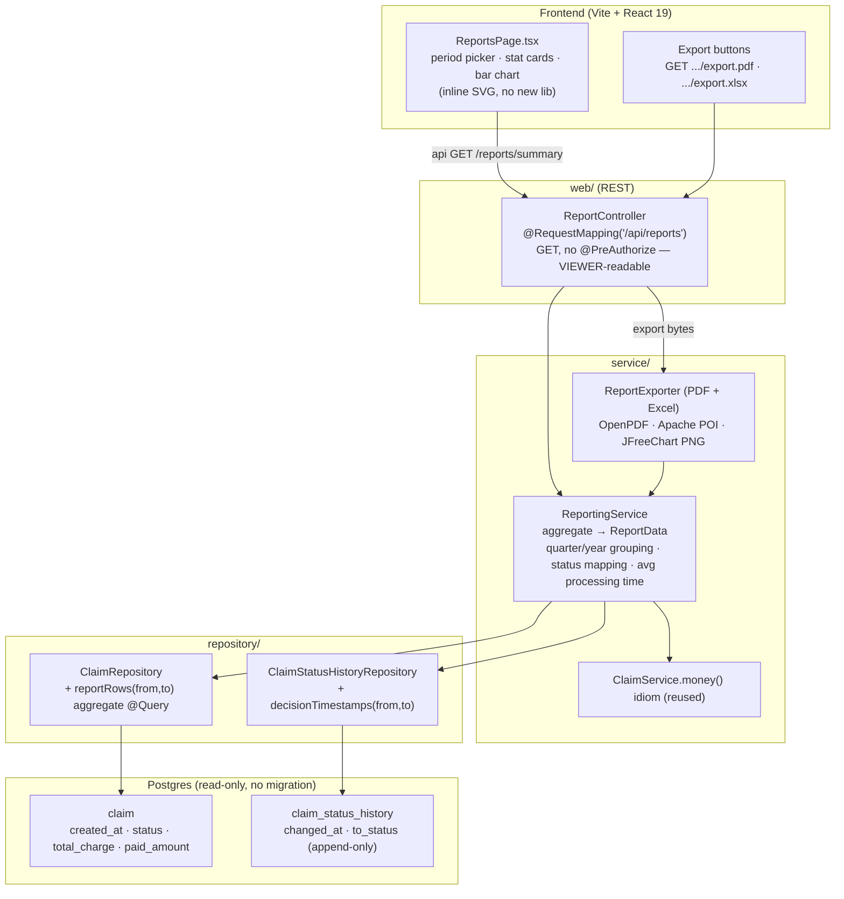

# Reporting — Technical Approach (S-3)

Staff Engineer approach for the quarterly & annual claims reporting feature (story **S-2**,
issued as build tickets **S-5 aggregation/API**, **S-6 exports**, **S-7 page**). This is the
design the engineers build to; it is deliberately the smallest thing that meets the story and
follows the patterns already on `Demo2`. Every fact below was read from source, not assumed.

## 1. Scope (from the story)

Per period — **quarterly** and **annual** — report:

- **Claims filed** (count)
- **Status breakdown**: approved / rejected / pending counts
- **Total claim amounts**
- **Average processing time**

Plus **PDF and Excel** export, and **at least one graph**. Read-only over existing data; **no
schema change, no Flyway migration** (next migration would be V3; we add none).

## 2. Where it fits — routing / service split

It mirrors the existing claim slice exactly. No new layer, no new pattern.



- **`web/ReportController`** — sibling to `web/ClaimController`, `@RestController @RequestMapping("/api/reports")`.
  Like the GET endpoints on `ClaimController` (`list`, `summary`, `get`, `history`) it carries
  **no `@PreAuthorize`**: reports are read-only, so a VIEWER may read them. This is the existing
  convention (writes get `@PreAuthorize("hasAnyRole(...)")`, reads do not) — do not invent a report-only role.
- **`service/ReportingService`** — sibling to `ClaimService`. Owns all aggregation and the
  metric definitions. Controllers stay thin: they parse the period and delegate, exactly as
  `ClaimController.summary()` delegates to `ClaimService.summary()`.
- **`service/ReportExporter`** (PDF + Excel) — takes the already-computed `ReportData` and renders
  bytes. Kept separate from `ReportingService` so aggregation has zero dependency on POI/OpenPDF
  and stays unit-testable without them.
- **`repository/`** — extend the existing repositories with two aggregate `@Query` methods
  (below). Follows `ClaimRepository.summaryByStatus()` / `outstandingReceivable()`.
- **`dto/ReportDtos.java`** — new file of Java `record`s in the same style as `dto/ClaimDtos.java`
  (`ClaimSummaryResponse`, `StatusBucket`, `PageResponse`).

### Endpoints

| Method | Path | Returns |
|---|---|---|
| `GET` | `/api/reports/summary?period={quarter\|year}&year=YYYY[&quarter=1..4]` | `ReportResponse` (JSON) |
| `GET` | `/api/reports/export.pdf?period=…&year=…[&quarter=…]` | `application/pdf`, `Content-Disposition: attachment` |
| `GET` | `/api/reports/export.xlsx?period=…&year=…[&quarter=…]` | `application/vnd.openxmlformats-officedocument.spreadsheetml.sheet`, attachment |

Period params validated the same way `ClaimController` validates its query params; a bad/absent
period is a `400` via the existing `GlobalExceptionHandler` (RFC 9457), not a stack trace.

## 3. How the report data is aggregated

Two data sources, both read-only:

- **`claim`** — `created_at` (`OffsetDateTime`, `NOT NULL`, set at creation), `status`,
  `total_charge`, `paid_amount` (both `NUMERIC(12,2)`).
- **`claim_status_history`** — append-only audit trail; `changed_at` (`OffsetDateTime`, `NOT NULL`),
  `to_status`. Nothing ever updates or deletes a row here, so it is a trustworthy timeline.

### Period bucketing

Group by **`created_at`** (see Decision 1). For a **quarterly** request we compute the
`[from, to)` half-open window for that calendar quarter; for **annual**, the whole year. The
window is built in the service from `year`/`quarter` params and passed to the repository — we do
**not** push `EXTRACT(QUARTER …)` grouping into JPQL, because a bounded `created_at >= :from AND
created_at < :to` predicate is portable across the H2-in-test / Postgres-in-prod split and lets a
single query serve both period types.

### Counts, status breakdown, totals — one aggregate pass

Extend `ClaimRepository` with a windowed version of the existing summary query:

```java
@Query("""
       SELECT c.status, COUNT(c),
              COALESCE(SUM(c.totalCharge), 0), COALESCE(SUM(c.paidAmount), 0)
       FROM Claim c
       WHERE c.createdAt >= :from AND c.createdAt < :to
       GROUP BY c.status
       """)
List<Object[]> reportRowsByStatus(@Param("from") OffsetDateTime from,
                                  @Param("to")   OffsetDateTime to);
```

`ReportingService` folds those rows exactly as `ClaimService.summary()` does:

- **Claims filed** = sum of the per-status counts.
- **Total claim amounts** = `SUM(total_charge)` (with paid alongside), coerced with the reused
  **`money(Object)`** idiom (`COALESCE(SUM(...),0)` returns an unpredictable `Number` subtype —
  never cast blind; scale 2, `HALF_UP`).
- **Status breakdown** maps the 9-value `ClaimStatus` enum into the three reported buckets
  (see Decision 2).

### Average processing time — from real timestamps

Definition (Decision 3): for each claim that has **reached a terminal decision**
(`PAID`, `PARTIALLY_PAID`, `DENIED`, `REJECTED`, `VOID` — i.e. `ClaimStatus.isTerminal()` /
non-open), processing time = `changed_at` of the row that moved it to that terminal status,
minus the claim's `created_at`. Average those durations across claims filed in the window.
Claims still open contribute to counts but not to the average (they have no processing time yet);
the report states the denominator so the number is honest.

```java
// ClaimStatusHistoryRepository — terminal-decision timestamp per claim in the window
@Query("""
       SELECT h.claim.id, MIN(h.changedAt)
       FROM ClaimStatusHistory h
       WHERE h.toStatus IN :terminal
         AND h.claim.createdAt >= :from AND h.claim.createdAt < :to
       GROUP BY h.claim.id
       """)
List<Object[]> firstTerminalDecisionAt(@Param("terminal") List<ClaimStatus> terminal,
                                       @Param("from") OffsetDateTime from,
                                       @Param("to")   OffsetDateTime to);
```

The service joins these against each claim's `created_at`, computes `Duration`, and averages
(reported in days, one decimal). Using history's `changed_at` rather than `updated_at` means the
number reflects when the decision actually happened, not when the row was last touched for any reason.

## 4. Visualization

- **On screen**: `ReportsPage.tsx` renders the status breakdown as a small **inline SVG bar chart**
  hand-drawn in the component — the frontend has **no chart library** and the story does not justify
  adding one for a single three-bar chart. Follows the existing "no new frontend dep" posture
  (package.json today: only react, react-dom, react-router-dom).
- **In exports**: the graph is baked **server-side** as a PNG with **JFreeChart** and embedded in
  both the PDF and the Excel sheet (Decision 4). This guarantees the "graph in the report"
  requirement is met in the exported artifact regardless of the client.

## 5. PDF & Excel generation — libraries

The backend pom has **no** PDF/Excel/chart dependency today. Add three, all with Spring-Boot-4-
compatible, non-viral licenses (POI is Apache-2.0; OpenPDF is LGPL/MPL — avoids iText's AGPL;
JFreeChart is LGPL). Versions are pinned explicitly because the Spring Boot parent does not manage them.

| Concern | Library | Why |
|---|---|---|
| Excel (.xlsx) | **Apache POI** `poi-ooxml` | The standard for `.xlsx` on the JVM; streams `SXSSFWorkbook` for large reports; Apache-2.0. |
| PDF | **OpenPDF** | Lightweight, LGPL/MPL — deliberately **not iText 7** (AGPL, would force our source open or a commercial license). |
| Chart PNG | **JFreeChart** | Renders the bar chart to a `BufferedImage`/PNG server-side for embedding in both exports; LGPL. |

Exports are generated **server-side** and streamed as `byte[]` with a `Content-Disposition:
attachment` header (the frontend has no CSV/PDF/xlsx libraries and should not grow them). The
export endpoints reuse `ReportingService` for the numbers, so the PDF, the Excel and the on-screen
figures can never disagree.

## 6. The trade-off accepted

**We anchor every period on `created_at` and accept that a claim's activity can land in a
different quarter from its service dates or its final adjudication.** A claim filed on 31 Mar and
paid on 2 Apr counts, in full, in Q1 (the quarter it was filed) — its payment is not re-attributed
to Q2. We chose this because `created_at` is `NOT NULL` on every row and never moves, so quarter
totals are **stable and reproducible** — re-running last quarter's report always yields the same
numbers. The alternative (attributing amounts to the quarter money moved) needs per-transaction
dated ledger rows the schema does not have, and would make historical reports mutate as claims
progress. If finance later needs cash-basis quarters, that is a new ledger source and its own
ticket — explicitly **out of scope** here.

## 7. Decisions resolved (the 4 the story raised)

1. **Period anchor → `created_at`.** `NOT NULL`, immutable, present on every claim. `submitted_at`
   is nullable (only set on the SUBMITTED transition) so it would silently drop DRAFT/never-submitted
   claims from "claims filed".
2. **approved / rejected / pending mapping** over the 9 statuses:
   - **approved** = `PAID` + `PARTIALLY_PAID` + `ACCEPTED`
   - **rejected** = `REJECTED` + `DENIED`
   - **pending** = `DRAFT` + `SUBMITTED` + `APPEALED`
   - **`VOID` excluded** from all three (withdrawn, no decision) — reported as a separate line so counts reconcile to total filed.
   Defined as a single mapping method on `ReportingService` so it is testable and used identically by JSON and exports.
3. **Processing time → history-based**, from `claim_status_history.changed_at` at first terminal
   decision minus `claim.created_at`. Only decided claims count toward the average; the denominator is reported.
4. **Chart → server-side PNG (JFreeChart)** embedded in PDF and Excel; on-screen chart is inline SVG
   with no new frontend dependency.

## 8. Explicitly out of scope

- Cash-basis / payment-dated reporting (needs a ledger the schema lacks).
- Per-payer / per-provider report dimensions (story is time-period only).
- Scheduled/emailed reports, CSV export, caching/materialized views (add only if a requirement names them).
- Any change to `claim` or `claim_status_history` schema, or a Flyway migration.

## 9. Build sequence for the engineers

1. **S-5** — `pom.xml` deps + `ReportDtos` + repository aggregate queries + `ReportingService` +
   `ReportController` `/summary`, with `@WebMvcTest`/service unit tests (H2, no DB) pinning the
   metric math and the status mapping.
2. **S-6** — `ReportExporter` (POI + OpenPDF + JFreeChart) + the two export endpoints; tests assert
   non-empty bytes and correct content type/disposition.
3. **S-7** — `ReportsPage.tsx` following `DashboardPage.tsx` exactly (stat cards `grid grid-4`,
   inline SVG chart, export buttons hitting the backend), route registered in `App.tsx`.

Gate everything with `cd backend && mvn -B clean verify` and `cd frontend && npm run build`. CI
wiring is deferred to the release ticket (the connected PAT lacks `workflow` scope, per the S-1 note).
