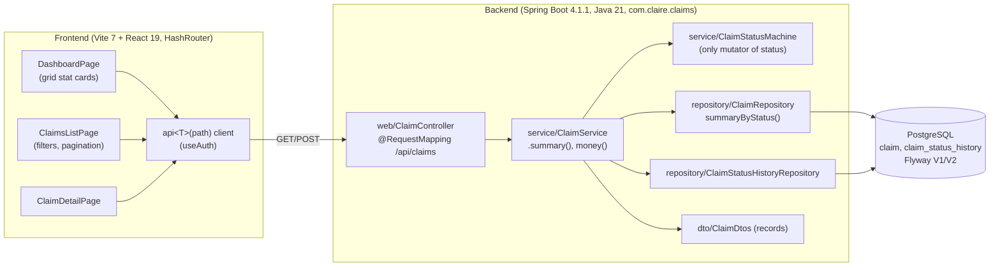
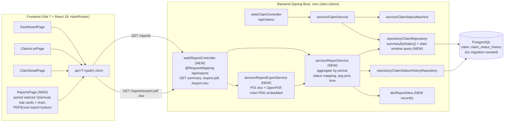

# S-2 — Quarterly & Annual Claims Reporting (PDF/Excel export + graph)

> **Status: PROPOSED — awaiting Commander review.** No build ticket (S-3…S-8) starts until this story is approved.
> Ticket: **S-2** · Base branch: `Demo2` · Repo: `cl-ahad/claim-management`
> All facts below are confirmed from source on `Demo2` (recorded in the S-1 repo note), not assumed.

## Why it matters

Claim operations and finance currently have the operational `DashboardPage` (live snapshot) and the searchable `ClaimsListPage`, but **no periodised reporting**: no way to pull "how did we do in Q3?" or "the full year", and no shareable artifact to hand to a manager, auditor, or payer. This feature adds a read-only **Reporting** surface that answers, per quarter and per year:

- **how many claims were filed**,
- **how they resolved** (approved / rejected / pending),
- **how much money they represent**, and
- **how long they take to process** —

and lets the user **download the report as PDF or Excel** with **at least one chart**, so the numbers leave the app in a form finance and leadership actually use.

It reuses the existing aggregation shape (`ClaimRepository.summaryByStatus()`, `ClaimService.money()`) and the read-only `/api/...` GET convention, so it adds a reporting slice without touching the write path, the state machine, or the schema.

## Scope

**Metrics (each computed for the selected period):**
1. **Claims filed** — count of claims whose anchor timestamp falls in the period.
2. **Status breakdown** — **approved / rejected / pending** counts (mapped from the 9-value `ClaimStatus` enum — see Decision 2).
3. **Total claim amounts** — `SUM(total_charge)` for the period (money formatted via existing `ClaimService.money()`; `paid = SUM(paid_amount)` shown alongside).
4. **Average processing time** — mean time from filing to first terminal/adjudicated status, over claims that reached such a status in the period (see Decision 3).

**Time periods:** **quarterly** (a chosen quarter, e.g. `2026-Q3`) and **annual** (a chosen year). One period per report.

**Exports:** **PDF** and **Excel (.xlsx)**, generated **server-side** (frontend has no PDF/xlsx libraries), returned as a file download (`Content-Disposition: attachment`).

**Visualization:** **at least one graph** in the report — status breakdown as a bar/pie chart, rendered on the frontend for the on-screen view **and** embedded as a PNG in the PDF/Excel exports so the downloaded artifact carries the graph too.

**Out of scope (this story):** monthly/weekly/custom-range reports; scheduled/emailed reports; per-payer or per-provider drill-down; CSV export; any change to claim write flow, the state machine, or the schema (reporting is read-only over existing tables — **no Flyway migration**).

## Acceptance criteria

**Data / API**
- [ ] **AC1 — Endpoint.** A read-only `GET /api/reports/summary?period=<Q|Y>&value=<2026-Q3|2026>` returns the four metrics for the requested period. Follows the existing GET convention (no write, no `@PreAuthorize` beyond the shared auth shell; VIEWER can read). Bad/empty period → RFC9457 error via the existing `GlobalExceptionHandler`; a period with no claims returns zeroed metrics, not an error.
- [ ] **AC2 — Claims filed.** The response includes `claimsFiled` = count of claims whose anchor timestamp (Decision 1) is within the period. Verified against a seeded fixture with claims inside and outside the window.
- [ ] **AC3 — Status breakdown.** The response includes `approved`, `rejected`, `pending` counts using the agreed mapping (Decision 2). The three buckets + any excluded statuses (e.g. `VOID`) reconcile to the total claim count for the period. `approved + rejected + pending + excluded == total`.
- [ ] **AC4 — Total amounts.** The response includes `totalCharge = SUM(total_charge)` and `totalPaid = SUM(paid_amount)` for the period, formatted through `ClaimService.money()`; matches a hand-summed fixture to the cent.
- [ ] **AC5 — Average processing time.** The response includes `avgProcessingDays` computed per Decision 3, over claims that reached a terminal/adjudicated state in the period; returns `null`/`0` (agreed sentinel) when no such claims exist, and is verified against a fixture with known status-history timestamps.
- [ ] **AC6 — Periods.** Both `period=Q` (quarterly) and `period=Y` (annual) are supported and produce the same metric set; quarter/year boundaries are computed correctly (Q1 = Jan–Mar, … Q4 = Oct–Dec; annual = calendar year), inclusive of the period start and end.

**Export**
- [ ] **AC7 — PDF export.** `GET /api/reports/export.pdf?period=…&value=…` returns a valid PDF (`application/pdf`, attachment filename e.g. `claims-report-2026-Q3.pdf`) containing all four metrics, the period label, and **at least one embedded chart** image. Opens in a standard viewer.
- [ ] **AC8 — Excel export.** `GET /api/reports/export.xlsx?period=…&value=…` returns a valid `.xlsx` (correct content type, attachment filename) with the four metrics in labelled cells/rows, amounts as numbers with a currency/number format, and **at least one embedded chart** image. Opens in Excel/LibreOffice without a repair prompt.
- [ ] **AC9 — Export parity.** The metric values in the PDF and Excel exports are identical to the values returned by `GET /api/reports/summary` for the same `period`+`value` (same aggregation path feeds both — no re-computation drift).

**Frontend**
- [ ] **AC10 — Reports page.** A `/reports` route renders a `ReportsPage` following the `DashboardPage` pattern exactly (same `Card`/`Money`/`StatusBadge`/`Loading`/`ErrorAlert`, `PageHeader`, `useSearchParams`, `grid grid-4` stat cards): a period selector (quarter/year), the four metrics as stat cards, at least one on-screen **chart** of the status breakdown, and **Export PDF / Export Excel** buttons that download the backend files. Page renders styled and error-free (verified with the running app), and is reachable from the existing nav.

**Non-functional / build**
- [ ] **AC11 — Build green.** `cd backend && mvn -B clean verify` and `cd frontend && npm install && npm run build` both pass; new backend units cover the aggregation (AC2–AC6) and export smoke (AC7–AC8) with `spring-boot-starter-test`.

## Open decisions for the Commander / Staff Engineer (settle before S-5 starts)

These are product/technical decisions the aggregation is built on; guessing them means rebuilding S-5. Recommendations from S-1's source reading:

1. **Period anchor timestamp.** Which timestamp puts a claim "in" a period — `created_at` or `submitted_at`? **Recommend `created_at`** (every claim has it; `submitted_at` is null for `DRAFT`). "Filed" arguably means submitted-to-payer, so this is a genuine choice.
2. **approved / rejected / pending mapping.** The enum has **9 values** (`DRAFT, SUBMITTED, ACCEPTED, PARTIALLY_PAID, PAID, REJECTED, DENIED, APPEALED, VOID`) — no literal approved/pending. **Recommend:** approved = `PAID + PARTIALLY_PAID + ACCEPTED`; rejected = `REJECTED + DENIED`; pending = `DRAFT + SUBMITTED + APPEALED`; `VOID` **excluded** (withdrawn). Confirm — this drives AC3.
3. **Processing-time definition.** **Recommend** history-based: per claim, `(changed_at of first terminal transition to PAID/PARTIALLY_PAID/DENIED/REJECTED) − (submitted_at, else created_at)`, averaged over claims reaching a terminal state in the window. Coarser alternative: `updated_at − created_at`. Confirm — this drives AC5.
4. **Chart: server-side vs frontend.** The **export** graph must be baked server-side (frontend has no libs). **Recommend** rendering the chart PNG server-side (e.g. JFreeChart) once and embedding it in both PDF and Excel, while the on-screen view uses a lightweight frontend chart. Confirm whether to add a frontend chart lib or render the same server PNG on-screen.

## System — before (the system the work goes into today)

## System — after (the system the work leaves behind)

`(NEW)` marks what this feature adds. No new DB objects; no migration.

## Delivery slices (already on the board — do not start until this story is approved)

| Ticket | Owner | Slice |
|---|---|---|
| S-3 | Ivy | Approach (Staff Engineer sign-off on the 4 decisions) |
| S-4 | Sam | Design |
| S-5 | Diego | Aggregation API (`ReportService`, date-window query, `/api/reports/summary`) |
| S-6 | Diego | Exports (POI xlsx + OpenPDF, embedded chart) |
| S-7 | Marco | ReportsPage + `/reports` route + on-screen chart |
| S-8 | Maya | Review / release |
